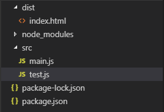

---
{
  tags: ['JavaScript', 'webpack', '构建工具']
}
---
# Webpack4.x入门

## 简单的打包例子
#### 准备
首先创建一个`my_project`文件夹，进入文件夹，使用npm init初始化生成`package.json`文件  
``` base
md my_project
cd my_project
npm init
```
再在该文件夹下新建`dist`文件夹以及`src`文件夹,`dist`文件夹下新建`index.html`文件，`src`文件夹下新建main.js文件以及`test.js`文件

项目目录结构:  
 

#### 安装webpack
``` base
npm i webpack -g
npm i webpack webpack-cli -D
```

#### 编写代码
我们在`index.html`中引入之后打包的js文件
``` javascript
<!DOCTYPE html>
<html lang="en">
<head>
    <meta charset="UTF-8">
    <meta name="viewport" content="width=device-width, initial-scale=1.0">
    <meta http-equiv="X-UA-Compatible" content="ie=edge">
    <title>Document</title>
</head>
<body>
    <script src="app.js"></script>
</body>
</html>
```
在test.js中导出一个模块
``` javascript
module.exports = function() {
    let hw = document.createElement('div');
    hw.innerHTML = 'Hello Webpack!';
    return hw;
}
```
之后再`main.js`中引入这个模块
``` javascript
const hw = require('./test');

document.body.appendChild(hw());
```

#### 使用webpack进行打包
``` base
webpack src/main.js --output dist/app.js
```
将`src`目录下的`main.js`文件打包到`dist`目录下生成`app.js`文件

此时打开`dist`目录下的`index.html`文件即可看到页面上显示Hello webpack!

#### 通过配置文件打包
在项目根目录下创建` webpack.config.js `,并在该文件下写下如下配置
``` javascript
// webpack.config.js
const path = require('path');

module.exports = {
    // 项目入口文件
    entry: path.join(__dirname, '/src/main.js'),
    output: {
        // 打包文件的存放目录
        path: path.join(__dirname, '/dist'),
        // 打包文件的文件名
        filename: 'app.js'
    }
}
```
此时只需在终端中运行`webpack`命令即可进行打包，这条命令会自动引用根目录下的`webpack.config.js`的配置进行打包。

## 构建本地服务
目前为止我们都是通过打开打包后的文件来查看页面，但在使用Vue、React等框架时都是运行在本地服务器上的

#### webpack-dev-server配置本地服务器
webpack提供了一个基于`node.js`的本地开发服务器，因为它是一个单独的组件，所以在webpack中使用前需要先将其安装为项目依赖
``` node
npm i webpack-dev-server -D
```
之后再`webpack.config.js`中添加`devServer`的配置
``` javascript
const path = require('path');

module.exports = {
    // 项目入口文件
    entry: path.join(__dirname, '/src/main.js'),
    output: {
        // 打包文件的存放目录
        path: path.join(__dirname, '/dist'),
        // 打包文件的文件名
        filename: 'app.js'
    },
    devServer: {
        // 本地服务器读取文件的目录
        contentBase: './dist',
        // 本地服务器端口
        port: '8081',
        // 当改变文件时是否刷新页面
        inline: true,
        // 设置为true时当问不存在的路由跳转到index.html页面
        historyApiFallback: true
    }
}
```
然后修改`package.json`,添加如下启动命令
``` json
{
  "name": "my_project",
  "version": "1.0.0",
  "description": "",
  "main": "index.js",
  "scripts": {
    "test": "echo \"Error: no test specified\" && exit 1",
    "build": "webpack",
    "dev": "webpack-dev-server --open"
  },
  "author": "",
  "license": "ISC",
  "devDependencies": {
    "webpack": "^4.25.1",
    "webpack-cli": "^3.1.2",
    "webpack-dev-server": "^3.1.10"
  }
}
```
其中`build`命令用于打包，即执行`webpack`命令,`dev`为开启一个本地服务器,`--open`是用于启动完服务器后自动打开浏览器

现在在终端输入`npm run dev`即可运行服务器

#### Source Maps
在开发过程中，代码调试自然是少不了的，而经过打包的文件是不容易找到出错的地方的,`Source Map`就是用来解决这个问题的
通过将`devtool`设置为`source-map`即会在打包时生成打包文件对应的`.map`文件,更易于调试定位错误
``` js
const path = require('path');

module.exports = {
    // 项目入口文件
    entry: path.join(__dirname, '/src/main.js'),
    output: {
        // 打包文件的存放目录
        path: path.join(__dirname, '/dist'),
        // 打包文件的文件名
        filename: 'app.js'
    },
    devServer: {
        // 本地服务器读取文件的目录
        contentBase: './dist',
        // 本地服务器端口
        port: '8088',
        // 当改变文件时是否刷新页面
        inline: true,
        // 设置为true时当问不存在的路由跳转到index.html页面
        historyApiFallback: true
    },
    devtool: 'source-map'
}
```
## Loaders
通过不同的loader，webpack可以实现对不同格式文件的处理

#### 配置css-loader
如果我们要加载一个css文件，需要安装配置`style-loader`和`css-loader`
``` base
npm i style-loader css-loader -D
```
在`webpack.config.js`文件的`module`下进行loader的配置
``` js
const path = require('path');

module.exports = {
    devtool: 'source-map',
    // 项目入口文件
    entry: path.join(__dirname, '/src/main.js'),
    output: {
        // 打包文件的存放目录
        path: path.join(__dirname, '/dist'),
        // 打包文件的文件名
        filename: 'app.js'
    },
    devServer: {
        // 本地服务器读取文件的目录
        contentBase: './dist',
        // 本地服务器端口
        port: '8088',
        // 当改变文件时是否刷新页面
        inline: true,
        // 设置为true时当问不存在的路由跳转到index.html页面
        historyApiFallback: true
    },
    module: {
        rules: [{
            // 匹配的文件
            test: /\.css$/,
            // 使用的loader
            use:['style-loader', 'css-loader']
        }]
    }
}
```
在`src`目录下创建`css`目录，在该目录下新建`app.css`文件:
``` css
/* app.css */
body{
    background: pink;
}
```
然后在main.js中引入
``` javascript
// main.js
import './css/app.css';
const hw = require('./test');

document.body.appendChild(hw());
```
此时运行`npm run dev`,页面已经变成了粉色

#### 配置sass
``` base
npm i sass-loader node-sass -D
```
增加sass的rules配置:
``` js
const path = require('path');

module.exports = {
    devtool: 'source-map',
    // 项目入口文件
    entry: path.join(__dirname, '/src/main.js'),
    output: {
        // 打包文件的存放目录
        path: path.join(__dirname, '/dist'),
        // 打包文件的文件名
        filename: 'app.js'
    },
    devServer: {
        // 本地服务器读取文件的目录
        contentBase: './dist',
        // 本地服务器端口
        port: '8088',
        // 当改变文件时是否刷新页面
        inline: true,
        // 设置为true时当问不存在的路由跳转到index.html页面
        historyApiFallback: true
    },
    module: {
        rules: [{
            // 匹配的文件
            test: /\.css$/,
            // 使用的loader
            use: ['style-loader', 'css-loader']
        }, {
            test: /\.(scss|sass)$/,
            use: ['style-loader', 'css-loader', 'sass-loader']
        }]
    }
}
```
在css目录下创建`style.scss`文件
``` css
/* style.scss */
$red: red;
body{
    color: $red;
} 
```
在`main.js`中引入`style.scss`
``` js
import './css/app.css';
import './css/style.scss';
const hw = require('./test');

document.body.appendChild(hw());
```
之后使用`npm run dev`启动服务器，会发现字体变为红色。

## Plugins
Plugins(插件)是用来扩展Webpack功能的，它们会在整个构建过程中生效，执行相关的任务。

#### 插件如何使用
使用某个插件，需要通过`npm`进行安装，然后在`webpack.config.js`配置文件的`plugins`配置项中添加该插件的实例。
到目前为止我们都是使用预先创建好的`index.html`文件并且手动引入`app.js`来运行项目，这里我们引入`HtmlWebpackPlugin`插件来帮我们自动生成`index.html`并且自动引入打包后的js文件。

首先安装插件:
``` base
npm i html-webpack-plugin -D
```
然后我们将`dist`目录整个删除，再在`src`目录下新建`index.html`用作文件模板(不设置`HtmlWebpackPlugin`也会生成默认的`html`文件)

在`webpack.config.js`中引入`HtmlWebpackPlugin`插件:
``` js
const path = require('path');
const webpack = require('webpack');
const HtmlWebpackPlugin = require('html-webpack-plugin');

module.exports = {
    devtool: 'source-map',
    // 项目入口文件
    entry: path.join(__dirname, '/src/main.js'),
    output: {
        // 打包文件的存放目录
        path: path.join(__dirname, '/dist'),
        // 打包文件的文件名
        filename: 'app.js'
    },
    devServer: {
        // 本地服务器读取文件的目录
        contentBase: './dist',
        // 本地服务器端口
        port: '8088',
        // 当改变文件时是否刷新页面
        inline: true,
        // 设置为true时当问不存在的路由跳转到index.html页面
        historyApiFallback: true
    },
    module: {
        rules: [{
            // 匹配的文件
            test: /\.css$/,
            // 使用的loader
            use: ['style-loader', 'css-loader']
        }, {
            test: /\.(scss|sass)$/,
            use: ['style-loader', 'css-loader', 'sass-loader']
        }]
    },
    plugins: [
        new HtmlWebpackPlugin({
            template: path.join(__dirname, '/src/index.html')
        })
    ]
}
```
然后使用`npm run build`打包，会发现`dist`目录以及`html`文件都会自动生成，并且生成的js文件也自动引入到html文件当中
``` html
<!DOCTYPE html>
<html lang="en">
<head>
    <meta charset="UTF-8">
    <meta name="viewport" content="width=device-width, initial-scale=1.0">
    <meta http-equiv="X-UA-Compatible" content="ie=edge">
    <title>Document</title>
</head>
<body>
    
<script type="text/javascript" src="app.js"></script></body>
</html>
```
#### 清理`dist`文件夹
之前我们在每次打包的时候，可能由于以前的代码遗留，导致`dist`目录比较杂乱，所以通常在每次构建的时候会先清理`dist`目录，此时就需要使用`CleanWebpackPlugin`插件
``` base
npm i clean-webpack-plugin -D
```
``` js
const path = require('path');
const webpack = require('webpack');
const HtmlWebpackPlugin = require('html-webpack-plugin');
const CleanWebpackPlugin = require('clean-webpack-plugin');

module.exports = {
    devtool: 'source-map',
    // 项目入口文件
    entry: path.join(__dirname, '/src/main.js'),
    output: {
        // 打包文件的存放目录
        path: path.join(__dirname, '/dist'),
        // 打包文件的文件名
        filename: 'app.js'
    },
    devServer: {
        // 本地服务器读取文件的目录
        contentBase: './dist',
        // 本地服务器端口
        port: '8088',
        // 当改变文件时是否刷新页面
        inline: true,
        // 设置为true时当问不存在的路由跳转到index.html页面
        historyApiFallback: true
    },
    module: {
        rules: [{
            // 匹配的文件
            test: /\.css$/,
            // 使用的loader
            use: ['style-loader', 'css-loader']
        }, {
            test: /\.(scss|sass)$/,
            use: ['style-loader', 'css-loader', 'sass-loader']
        }]
    },
    plugins: [
        new HtmlWebpackPlugin({
            template: path.join(__dirname, '/src/index.html')
        }),
        new CleanWebpackPlugin(['dist']),
    ]
}
```
现在运行`npm run build`后，`webpack`会先将`dist`目录删除，然后再创建新的`dist`目录

#### 热更新
`HotModuleReplacementPlugin`是一个很使用的插件，可以在我们修改代码后自动刷新预览页面
* 需要在`devServer`配置项中添加`hot: true`参数
* 在`plugins`中添加`HotModuleReplacementPlugin`的配置项，因为`HotModuleReplacementPlugin`是`webpack`模块自带的，所以无需额外安装

``` js
const path = require('path');
const webpack = require('webpack');
const HtmlWebpackPlugin = require('html-webpack-plugin');
const CleanWebpackPlugin = require('clean-webpack-plugin');
module.exports = {
    devtool: 'source-map',
    // 项目入口文件
    entry: path.join(__dirname, '/src/main.js'),
    output: {
        // 打包文件的存放目录
        path: path.join(__dirname, '/dist'),
        // 打包文件的文件名
        filename: 'app.js'
    },
    devServer: {
        // 本地服务器读取文件的目录
        contentBase: './dist',
        // 本地服务器端口
        port: '8088',
        // 当改变文件时是否刷新页面
        inline: true,
        // 设置为true时当问不存在的路由跳转到index.html页面
        historyApiFallback: true,
        // 热更新
        hot: true
    },
    module: {
        rules: [{
            // 匹配的文件
            test: /\.css$/,
            // 使用的loader
            use: ['style-loader', 'css-loader']
        }, {
            test: /\.(scss|sass)$/,
            use: ['style-loader', 'css-loader', 'sass-loader']
        }]
    },
    plugins: [
        new HtmlWebpackPlugin({
            template: path.join(__dirname, '/src/index.html')
        }),
        new CleanWebpackPlugin(['dist']),
        new webpack.HotModuleReplacementPlugin()
    ]
}
```
此时运行`npm run dev`,修改`test.js`的内容后，预览页面会自动刷新，但因为使用的了`source-map`的原因，反应会比较慢

## 项目优化

#### 代码分离
现在的开发模式都是提倡模块化，我们将前面的`webpack.config.js`配置文件拆分:
* 在根目录下新建`webpack.base.js`、`webpack.dev.js`、`webpacl.prod.js`,分别代表基础配置文件、开发环境配置文件、生产环境配置文件。
* 安装合并模块插件
``` base
npm i webpack-merge -D
```
* 将`webpack.config.js`的代码拆分到上述三个文件中:
``` js
// webpack.base.js
const path = require('path');
const webpack = require('webpack');
const HtmlWebpackPlugin = require('html-webpack-plugin');
module.exports = {
    devtool: 'source-map',
    // 项目入口文件
    entry: path.join(__dirname, '/src/main.js'),
    output: {
        // 打包文件的存放目录
        path: path.join(__dirname, '/dist'),
        // 打包文件的文件名
        filename: 'app.js'
    },
    module: {
        rules: [{
            // 匹配的文件
            test: /\.css$/,
            // 使用的loader
            use: ['style-loader', 'css-loader']
        }, {
            test: /\.(scss|sass)$/,
            use: ['style-loader', 'css-loader', 'sass-loader']
        }]
    },
    plugins: [
        new HtmlWebpackPlugin({
            template: path.join(__dirname, '/src/index.html')
        }),
        new webpack.HotModuleReplacementPlugin()
    ]
}
```
``` js
// webpack.dev.js
const merge = require('webpack-merge'); 
const base = require('./webpack.base.js'); 

module.exports = merge(base, { 
    devServer: {
        contentBase: "./dist",
        port: "8088",
        inline: true,
        historyApiFallback: true,
        hot: true
    }
})
```
``` js
// webpack.prod.js
const merge = require('webpack-merge');
const base = require('./webpack.base.js');
const CleanWebpackPlugin = require('clean-webpack-plugin');

module.exports = merge(base, {
    devtool: 'source-map', 
    plugins: [
        new CleanWebpackPlugin(['dist']),
    ]
})
```
* 设置`package.json`的`scripts`命令
``` json
{
  "name": "my_project",
  "version": "1.0.0",
  "description": "",
  "main": "index.js",
  "scripts": {
    "test": "echo \"Error: no test specified\" && exit 1",
    "build": "webpack --config webpack.prod.js",
    "dev": "webpack-dev-server --open --config webpack.dev.js"
  },
  "author": "",
  "license": "ISC",
  "devDependencies": {
    "node-sass": "^4.10.0",
    "sass-loader": "^7.1.0",
    "webpack": "^4.25.1",
    "webpack-cli": "^3.1.2",
    "webpack-dev-server": "^3.1.10",
    "webpack-merge": "^4.1.4"
  },
  "dependencies": {
    "clean-webpack-plugin": "^1.0.0",
    "css-loader": "^1.0.1",
    "html-webpack-plugin": "^3.2.0",
    "style-loader": "^0.23.1"
  }
}
```
然后删除`webpack.config.js`，之后运行`npm run build`以及`npm run dev`应该和之前的效果一样

## 总结
本文将webpack的常用功能都过了一遍，希望能对你有所帮助!
