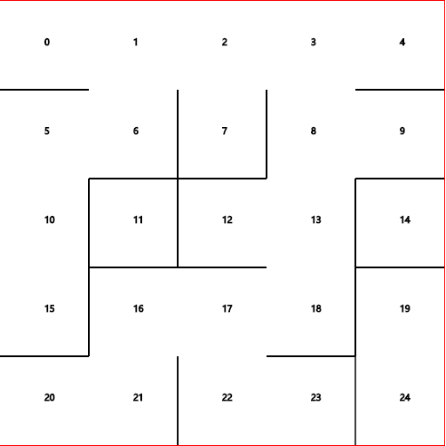

---
{
  tags: ['JavaScript', 'Demo']
}
---
# 迷宫生成
> 因为公司有一个游戏上的需求是类似生成一个随机平面地图，随机设置障碍物，玩家位置随机，但要求双方始终能够相见，所以记录一下类似迷宫的生成代码，公司使用的是cocos引擎，TypeScript语言编写，这里使用JavaScript代码写一个Demo

  

这里是在保证10到20这个点走通的情况下随机生成地图

随机地图的生成在于如何确定两个固定点之间是否相通的判断

-1/0 | -1/1 | -1/2 
:-: | :-: | :-: 
-1/3 | -1/4| -1/5 
-1/6 | -1/7 | -1/8

以一个3 X 3的格子为例，将其每个格子初始化为-1，此时选择两个格子随机打通，譬如下标0和3的格子打通，则将下标为0的格子标记为3，下标为3的格子标记为0，则表示0 与 3之间的墙不生成
3 /0 | -1/1 | -1/2 
:-: | :-: | :-: 
0 /3 | -1/4| -1/5 
-1/6 | -1/7 | -1/8

所以需要编写一个工具类
``` javascript
export default class UnionSet {
    constructor(size) {
        this.setArray = new Array(size);
        for(let i = 0; i < this.setArray.length; i++) {
            this.setArray[i] = -1;
        }
    }
}
```
该类用于接收格子总数并初始化数组

接着添加union函数，用于将两个打通的点标记, 并将所有打通的点标记为相同的一个数字
``` javascript
// 接收两个点
union(p1, p2) {
    if(this.setArray[p1] === -1 && this.setArray[p2] === -1) {
        this.setArray[p1] = p2;
        this.setArray[p2] = p1;
    } else if(this.setArray[p1] === -1 && this.setArray[p2] !== -1) {
        this.setArray[p1] = p2;
    } else if(this.setArray[p1] !== -1 && this.setArray[p2] === -1) {
        this.setArray[p2] = p1;
    }
    let v = this.setArray[p1];
    for(let i = 0; i < this.setArray.length; i++) {
        if(this.setArray[i] === v) {
            this.setArray[i] = this.setArray[p2];
        }
    }
}
```
还需要一个函数用于确定两点是否已经相通
``` javascript
sameSet(p1, p2) {
    return this.setArray[p1] !== -1 && this.setArray[p2] !== -1 && this.setArray[p1] === this.setArray[p2];
}
```

然后需要一个linkedMap类，来随机选择点打通，并绘制到页面上
``` javascript
import UnionSet from './UnionSet.js'
export default class LinkedMap {
    // 接受5个参数，canvas对象，列数，行数，以及需要相通的两个点 以及引入工具类并初始化工具类
    constructor(canvas, column, row, p1, p2) {
        this.canvas = canvas;
        this.column = column;
        this.row = row;
        this.cells = column * row;
        this.p1 = p1;
        this.p2 = p2;
        this.unionSets = new UnionSet(this.cells);
        this.linkedMap = [];
    }
}
```
首先需要随机选取两个相邻点来打通
``` javascript
pickRandomCellPairs() {
    let cell = Math.random() * this.cells >> 0;
    let neiborCells = [];
    let row = cell / this.column >> 0;
    let column = cell % this.column;
    // 断定随机选取的点上下左右是否有格子存在,如果有则添加到数组中
    if(row !== 0) {
        neiborCells.push(cell - this.column)
    }
    if(row !== this.row - 1) {
        neiborCells.push(cell + this.column)
    }
    if(column !== 0) {
        neiborCells.push(cell - 1)
    }
    if(coluimn !== this.column - 1) {
        neiborCells.push(cell + 1)
    }
    // 在相邻格子中选择一个格子
    let index = Math.random() * neiborCells.length >> 0;
    return [cell, neiborCells[index]];
}
```
还需要一个方法，用于记录被打破的墙体
``` javascript
addLinkedMap(x, y) {
    if(!this.linkedMap[x]) this.linkedMap[x] = [];
    if(!this.linkedMap[y]) this.linkedMap[y] = [];
    if(this.linkedMap[x].indexOf(y) < 0) this.linkedMap[x].push(y);
    if(this.linkedMap[y].indexOf(x) < 0) this.linkedMap[y].push(x);
}
```
判断墙体两点是否已在同一个区域
``` javascript
playerLinked() {
    return this.unionSets.sameSet(this.p1, this.p2);
}
```
用于循环打通墙体，直到玩家在一个区域为止
``` javascript
generate() {
    while(!this.playerLinked()) {
        var cellPairs = this.pickRandomCellPairs();
        if(!this.unionSets.sameSet(cellPairs[0], cellPairs[1])) {
            this.unionSets.union(cellPairs[0], cellPairs[1]);
            this.addLinkedMap(cellPairs[0], cellPairs[1]);
        }
    }
}
```
绘制
``` javascript
drawMap() {
    this.generate();
    let cellWidth = this.canvas.width / this.column;
    let cellHeight = this.canvas.height / this.row;
    let ctx = this.canvas.getContext('2d');
    for(let i = 0; i < this.cells; i++) {
        let column = i / this.column >> 0;
        let row = i % this.column;
        ctx.strokeText(i, row * cellWidth + cellWidth / 2, column * cellHeight + cellHeight / 2);
        if(row !== this.row - 1 && (!this.linkedMap[i] || this.linkedMap[i].indexOf(i + 1) < 0)) {
            ctx.moveTo((row + 1) * cellWidth, column * cellHeight);
            ctx.lineTo((row + 1) * cellWidth, column * cellHeight + cellHeight);
        }
        if(column !== this.column - 1 && (!this.linkedMap[i] || this.linkedMap[i].indexOf(i + this.column) < 0 )) {
            ctx.moveTo(row * cellWidth, (column + 1) * cellHeight);
            ctx.lineTo((row + 1) * cellWidth, (column + 1) * cellHeight)
        }
        ctx.stroke();
    }
}
```
迷宫的生成代码就完成了, 每次随机选取相邻的两个格子打通，直到两点在一个区域为止

页面代码
``` javascript
<!DOCTYPE html>
<html lang="zh">
    <head>
        <meta charset="UTF-8" />
        <meta name="viewport" content="width=device-width, initial-scale=1.0" />
        <meta http-equiv="X-UA-Compatible" content="ie=edge" />
        <title>Document</title>
    </head>
    <style>
        canvas {
            border: 1px solid red;
        }
    </style>
    <body>
        <canvas id="canvas" width="500" height="500">
    </canvas>
    </body>
    <script type="module">
        import LinkedMap from './js/LinkedMap.js'

        let canvas = document.querySelector('#canvas');
        let cell = {
            column: 5,
            row: 5
        }
        const linkedMap = new LinkedMap(canvas, cell.column, cell.row, 10, 20);
        linkedMap.drawMap()
    </script>
</html>
```
