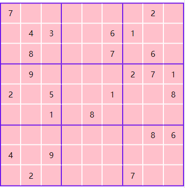

---
{
  tags: ['JavaScript', 'Demo']
}
---
# 数独生成
> 之前写过一个数独生成程序，发现比想象中的逻辑复杂，现在用一种更简单的方式来实现

效果如下图,样式文件由css编写而成,这里不做赘述，主要讲怎么生成一个简单的数独数组


### 思路
因为之前使用java写过一个数独生成程序，大致的思路就是暴力生成，通过记录每一步的行为,在无数可填时回退生成过程，效率极低
所以这次换一个方式来生成，大致的思路就是以一个数字为基准，以行为标准在每行填入这个数字，满足每行每列每宫有且仅有一个数字的要求

### 工具类的实现
新建``` util.js ```文件,用以编写数独生成中需要使用到的工具函数

编写``` makeRow ```函数以及``` makeMatrix ```,用以初始化单行数独数组以及完整的九宫格数独数组
``` js
const matrixToolkit = {
  makeRow(v = 0) {
    const array = new Array(9);
    array.fill(v);
    return array
  },
  makeMatrix(v = 0) {
    return Array.from({ length: 9 })
                .map(() => this.makeRow(v));
  }
}
```
编写``` shuffle ```函数用以打乱数组,该函数接受一个数组参数,返回一个数组参数
``` js
...
shuffle(array) {
  const endIndex = array.length - 2;
  for(let i = 0; i<= endIndex; i++) {
    const j = i + Math.floor(Math.random() * (array.length - i));
    [array[i], array[j]] = [array[j], array[i]];
  }
  return array;
}
```

因为在数组生成过程中需要使用到宫的数据以判断当前数字在宫中是否唯一,所以需要添加一个宫的操作函数以将```横纵坐标```转换为```宫坐标```并获得```宫坐标```内数据,所以在```util.js```函数内新建```boxToolkit```对象用以存储对宫操作的函数

``` js
const boxToolkit = {
    /**
     * 将横纵坐标转换为宫坐标
     * @param {*} rowIndex 横坐标
     * @param {*} colIndex 纵坐标
     */
    converToBoxIndex(rowIndex, colIndex) {
        return {
            boxIndex: Math.floor(rowIndex / 3) * 3 + Math.floor(colIndex / 3),
            cellIndex: rowIndex % 3 * 3 + colIndex % 3
        }
    },
    /**
     * 获得宫数据
     * @param {*} matrix 当前矩阵数据
     * @param {*} boxIndex 宫坐标
     */
    getBoxCells(matrix, boxIndex) {
        const startRowIndex = Math.floor(boxIndex / 3) * 3;
        const startColIndex = boxIndex % 3 * 3;
        const result = [];
        for(let cellIndex = 0; cellIndex < 9; cellIndex++) {
            const rowIndex = startRowIndex + Math.floor(cellIndex / 3);
            const colIndex = startColIndex + cellIndex % 3;
            result.push(matrix[rowIndex][colIndex]);
        }
        return result;
    }
}
```
目前的做法是从1到9依次在每一行填完一个数字再进入到下一个数字的循环,所以每次填入一个数字时都要判断当前格子是否可填，可填则填入数字,进入到下一行或者新一个数字的循环，否则则在当前行另选格子进行填写,所以需要在```matrixToolkit```对象中添加``` checkFillable ``` 函数用以检查当前待填写数字是否符合``` 行 ``` ```列``` ```宫```唯一的条件
``` js
...
    /**
     * 检查指定位置是否可以填写数字
     * @param {*} matrix 当前数组矩阵
     * @param {*} n 待填写的数字
     * @param {*} rowIndex 横向坐标
     * @param {*} colIndex 纵向坐标
     */
    checkFillable(matrix, n, rowIndex, colIndex) {
        const row = matrix[rowIndex];
        const column = this.makeRow().map((v, i) => matrix[i][colIndex]);
        const { boxIndex } = boxToolkit.converToBoxIndex(rowIndex, colIndex);
        const box = boxToolkit.getBoxCells(matrix, boxIndex);
        for(let i = 0; i < 9; i++) {
            if(row[i] === n
                || column[i] === n
                || box[i] === n) {
                    return false;
            }
        }
        return true;
    }
```
再将两个对象暴露出来以供外界调用
``` js
export default class Toolkit {
  static get matrix() {
    return matrixToolkit;
  }
  static get box() {
    return boxToolkit;
  }
}
```
### 数独的生成逻辑
编写``` Generator ```类用以编写数独的生成逻辑,引入编写好的```util```工具类
``` js
import Toolkit from '../util/util.js'

export default class Generator {
  ...
}
```

添加```internalGenerte```函数作为数独生成的入口函数,并初始化数组数据, 其中```matrix```为数独的数据数组,```orders```为随机生成的打乱数组,用以随机选择每一行数字的填入格子
``` js
internalGenerate() {
  // 数独数据
  this.matrix = Toolkit.matrix.makeMatrix();
  // 用以随机选择填入格子
  this.orders = Toolkit.matrix.makeMatrix()
                            .map(row => row.map((v, i) => i))
                            .map(row => Toolkit.matrix.shuffle(row));
  for(let n = 1; n <= 9; n++) {
    if(!this.fillRow(n, 0)) {
      return false;
    }
  }
  return true;
}
```
添加```fillRow```函数用以填入数字并通过递归调用完成对整个数独数据的生成
``` js
fillRow(n, rowIndex) {
  if(rowIndex > 8) return true;
  const row = this.matrix[rowIndex];
  const orders = this.orders[rowIndex];
  for(let i = 0; i < 9; i++) {
    const colIndex = orders[i];
    if(row[colIndex]) {
      continue;
    }
    if(!Toolkit.matrix.checkFillable(this.matrix, n, rowIndex, colIndex)) {
      continue;
    }
    row[colIndex] = n;
    if(!this.fillRow(n, rowIndex + 1)) {
      row[colIndex] = 0;
      continue;
    }
    return true;
  }
  return false;
}
```
添加```generate```函数,判断当前数独是否生成成功,失败则再次生成,成功则返回数据

``` js
generate() {
  while(!this.internalGenerate()) {
    console.log('try again')
  }
  return this.matrix;
}
```
至此，单纯的数独生成逻辑完成,像示意图中一样想要对数组进行操作则需要自行编写操作逻辑代码。